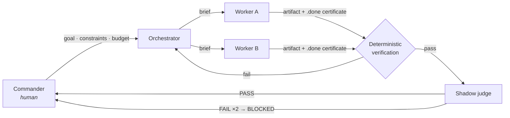

# Darth Harness

> **"I find your lack of tests disturbing."**

An orchestration harness for running multiple AI coding agents under evidence
contracts — where "done" is a verifiable claim, not a vibe.

Darth Harness turns one interactive session into an **orchestrator** that
decomposes work, briefs disposable **workers**, and submits their output to an
independent **judge** — with every completion claim backed by machine-checkable
evidence. State lives in files and git, not in the conversation, so the whole
operation survives session death and even switching model vendors mid-project.

## The problem

Agentic coding doesn't fail for lack of capability. It fails for lack of
accountability:

- An agent reports *"done"* — you have its word, and nothing else.
- Decisions and context evaporate when the session hits its limit.
- Two agents write to the same file; nobody notices until the diff is garbage.
- Retry loops burn tokens silently, with no ceiling and no receipt.
- The agent that wrote the code grades the code. It passes.

Most multi-agent frameworks answer this with *more agents*. Darth Harness
answers it with **contracts**: who may write where, what "finished" means, what
evidence is required, and where execution must stop.

## How it works



Four roles, strictly separated:

| Role | Owns | Cannot |
|---|---|---|
| **Commander** (human) | Goals, budgets, kill/go decisions | — |
| **Orchestrator** | Decomposition, briefs, verdict bookkeeping | Write code itself |
| **Worker** | One brief, one run, declared write paths only | Touch control files, spawn agents |
| **Judge** | Adversarial review of the evidence bundle | Grade its own output |

Every worker and judge runs in a **visible terminal pane** — never as a hidden
subagent. If it's doing work, you can watch it.

## The contracts

**Evidence, not claims.** A worker's `.done` marker is a completion
*certificate*: run ID, artifact hashes, test commands and raw output. The
orchestrator independently re-verifies it before the task counts. "It should
work" scores zero.

**Shadow judging.** Verification catches what machines can catch; the judge
hunts what they can't — invented problems, unsourced claims, happy-path demos.
It runs in a separate session, interrogates the artifact (not the worker's
self-report) across five axes, and must cite file-and-line for every verdict.
Two consecutive failed fixes escalate to a human instead of looping forever.

**Ceremony proportional to risk.** Tasks are graded T0–T3. A formatting sweep
gets one worker and a diff check; an irreversible migration gets independent
review and two human approval gates. The full harness is never the default.

**Code is liability.** Before any implementation, the execution contract
demands a recorded *Lean Gate* verdict: could this be solved by nothing, by
existing code, by the standard library, by an installed dependency? Workers
don't launch without it.

**Hard budgets.** Time, model calls, tokens, and edit volume are enforced by
the runner, not by the agent's good intentions. Exceeding a ceiling produces a
`BUDGET_STOP` with evidence and halts dispatch — budgets never silently grow.

**Model-neutral survival.** Canonical state is markdown, YAML, and git. A new
session — same model or a different vendor — reads the handoff files, diffs
them against actual git state, and refuses to proceed on any mismatch. Silent
model swaps are forbidden by contract.

**Verification receipts.** Deterministic checks that already passed on an
identical tree are reused by hash-linked receipt instead of re-run. Anything
time- or network-dependent is never cached.

## Quick start

```bash
git clone https://github.com/KimSehyun9797/darth-harness.git
cd darth-harness
./install.sh
```

`install.sh` is idempotent and reports readiness honestly across four groups
(core, multi-model, knowledge sync, optional). Requirements: `git`, `yq`, and
[cmux](https://github.com/wandb/cmux) (falls back to tmux). Multi-model
operation uses the `claude` and/or `codex` CLIs. Primary platform is macOS.

Then, in a Claude Code or Codex session:

- **`"하네스 시작 <project>"`** — scaffold a new project: template copy,
  scoping interview, and a machine gate (`scaffold-check.sh`) that must pass —
  including a live worker round-trip smoke test — before any real dispatch.
- **`"하네스 재개"`** — resume from files, not memory: read the state, diff it
  against git and run logs, report any mismatch before proceeding.

## Repository layout

| Path | Purpose |
|---|---|
| `doctrine/` | Operating rules that survive model changes — orchestration, judging, commanding |
| `template/` | Project skeleton: state files, execution contract, checkpoint & decision tooling |
| `scripts/` | Dispatch, verification, and status layer (bash; `eval`-free by rule) |
| `skills/harness/` | Shared trigger skill for Claude Code and Codex |
| `tests/` | 350+ deterministic tests, rejection-path first — no live agents required |
| `MODELS.yaml` | Logical role → CLI/model registry; a model generation swap edits one file |

## Verification

```bash
bash tests/run-tests.sh
```

The suite exercises contract violations, dispatch refusals, budget stops,
migration paths, and receipt integrity. CI lints on Linux and runs the full
suite on macOS.

## Further reading

- [Case study](docs/case-study.md) *(Korean)* — how the harness got slow doing
  everything "right", and how task grading, selective context, receipts, and
  hard budgets removed the repeated cost without removing the verification.
- In-repo documentation (doctrine, templates) is currently written in Korean;
  the contracts and scripts are language-neutral.

## License

[MIT](LICENSE) — open source; use it, fork it, grill your agents with it.
