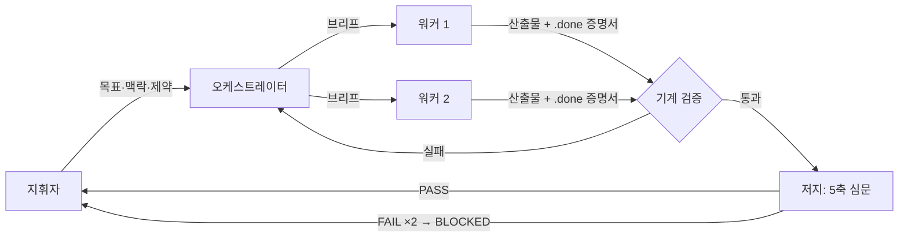

# Darth Harness

> **"I find your lack of tests disturbing."**

여러 AI 코딩 에이전트를 지휘하는 오케스트레이션 하네스.
일을 쪼개서 맡기고, 결과를 증거로 검증하고, 설익은 산출물은 다시 루프에 넣고,
예산을 넘으면 스스로 멈춘다. 클론 한 번, 트리거 한 마디로 어떤 세션(Claude Code,
Codex)에서든 같은 방식으로 재현된다.

---

## 왜 필요한가

AI 코딩 도구 하나에 긴 작업을 맡기면 시간이 지나며 같은 문제가 반복된다.

- 무엇을 왜 결정했는지, 세션이 끝나면 사라진다.
- **"완료했습니다"라는 말**과 **실제로 검증된 완료**가 구분되지 않는다.
- 세션 한도에 걸리거나 모델을 바꾸면 진행 상황이 증발한다.
- 에이전트를 늘릴수록 누가 무엇을 바꾸는지 흐려진다.

Darth Harness는 이 문제를 프롬프트가 아니라 **구조**로 푼다. 에이전트의 선의를
믿는 대신, 누가 무엇을 바꿀 수 있는지 / 무엇이 "끝났다"는 뜻인지 / 실패하면
어디서 멈추는지를 기계가 강제한다.

| 역할 | 하는 일 |
|---|---|
| 지휘자 (사람) | 목표, 예산, 건드리면 안 되는 것을 정한다 |
| 오케스트레이터 | 일을 나누고, 브리프를 쓰고, 판정한다 — 직접 구현하지 않는다 |
| 워커 | 허용된 파일만 고치고 관련 검사를 실행한다 |
| 저지 | 워커와 분리된 세션에서 결과와 증거를 심문한다 |
| Git + 상태 파일 | 결정, 실행, 검증, 다음 할 일을 세션 밖에 보존한다 |

## 작동 방식



모든 워커와 저지는 숨은 서브에이전트가 아니라 **사용자가 직접 볼 수 있는
터미널 pane**에서 실행된다. 무엇이 돌아가는지 항상 눈으로 확인할 수 있다.

## 핵심 설계

**증거 계약** — `.done`은 완료 선언이 아니라 증명서다. 실행 ID, 산출물 해시,
테스트 결과가 기재되고, 오케스트레이터가 내용을 재검증한 뒤에만 VERIFIED가 된다.
"될 것이다"는 0점이다.

**섀도우 저지** — 산출물을 만든 에이전트가 스스로 채점하지 않는다. 별도 세션의
저지가 현실성·근거·작동·대안 대비 우위·전달력 5축 + 프로젝트별 완료 기준으로
심문하고, 모든 판정에 산출물 안의 구체적 위치를 인용해야 한다. 자동 수정은
최대 2회, 그 뒤엔 사람에게 돌아온다.

**작업 등급 T0–T3** — 모든 작업에 풀 하네스를 돌리지 않는다. 반복 작업(T0)은
워커 하나와 자동 검증만, 고위험 작업(T3)은 사람 승인 2회까지. 절차의 무게가
작업의 위험에 비례한다.

**Lean Gate** — 코드는 자산이 아니라 부채다. 구현 전에 `불필요 → 기존 코드 →
표준 라이브러리 → 플랫폼 기본 → 설치된 의존성 → 최소 새 코드` 순서로 따지고,
결론과 근거를 실행 계약에 기록해야만 워커가 기동된다.

**하드 예산과 BUDGET_STOP** — 시간·모델 호출·토큰·수정량 상한을 실행기가
강제한다. 초과하면 증거를 남기고 멈춘다. 조용히 예산을 늘리는 일은 없다.

**모델 중립 인계** — 상태의 정본은 대화가 아니라 파일(STATUS, HANDOFF,
tasks.yaml)과 Git이다. 세션이 끊기거나 모델이 바뀌어도(Claude ↔ Codex) 새
세션이 파일을 읽고 실제 Git 상태와 대조한 뒤 이어간다. 조용한 모델 교체는
금지된다.

**검증 영수증** — 같은 코드 상태에서 이미 통과한 결정론 검사는 영수증으로
재사용한다. 반복 검사 비용은 줄이되, 시간·네트워크에 의존하는 검증은 절대
재사용하지 않는다.

## 설치

```bash
git clone https://github.com/KimSehyun9797/darth-harness.git
cd darth-harness
./install.sh
```

`install.sh`는 멱등이다. 준비 상태를 Core / Multi-model / Knowledge sync /
Optional 4개 그룹으로 정직하게 보고하고, 사람 선택이 필요한 단계는 명령어를
출력하고 멈춘다.

필수 의존성: `git`, `yq`, [cmux](https://github.com/wandb/cmux)(없으면 tmux 폴백).
멀티모델 운영에는 `claude` 또는 `codex` CLI가 필요하다.

## 사용

새 프로젝트:

```text
"하네스 시작 <프로젝트명>"
```

템플릿 복사 → 스캐폴딩 인터뷰(목표·제약·완료 기준·위임 레벨) →
`scaffold-check.sh`가 기계 검사와 에코 워커 왕복 스모크를 통과해야 실제 워커를
기동할 수 있다.

재개:

```text
"하네스 재개"
```

대화 기억이 아니라 상태 파일을 읽는다. 기재된 실행 ID·커밋·완료 마커를 실제
Git과 대조하고, 어긋나면 진행하지 않고 보고한다.

30초 상태 파악:

```bash
scripts/status.sh
```

`install.sh --enable-live-status`를 켜면 매 하네스 세션에 하단 Status TUI pane이
자동으로 열려 프로젝트 진행률, 워커, 실제 모델, 한도를 한 화면에서 보여준다.
기존 프로젝트를 최신 live status 계약으로 옮길 때는
`scripts/migrate-live-status.sh --dry-run`으로 변경 내용을 먼저 확인한다.

## 저장소 구조

| 경로 | 내용 |
|---|---|
| `doctrine/` | 일하는 방식 — 모델이 바뀌어도 유지되는 운영 규약 |
| `scripts/` | 디스패치·검증·상태 레이어 (bash, `eval` 금지) |
| `template/` | 새 프로젝트 뼈대 (상태 파일, 실행 계약, 체크포인트 도구) |
| `skills/harness/` | Claude Code·Codex 공용 트리거 스킬 |
| `tests/` | 결정론 테스트 스위트 (mux 불필요, 거부 경로 중심) |
| `MODELS.yaml` | 논리 역할 → 실제 CLI·모델 매핑. 모델 세대가 바뀌면 이 파일만 수정 |

## 검증

```bash
bash tests/run-tests.sh
```

360개 이상의 결정론 테스트가 계약 위반·거부 경로·마이그레이션·예산 강제를
검사한다. CI는 Linux와 macOS에서 shellcheck와 전체 스위트를 실행한다.

## 더 읽기

- [사례 연구: 안전한 에이전트 시스템이 너무 느려졌을 때](docs/case-study.md) —
  이 하네스가 왜 느려졌고, 검증을 없애지 않으면서 어떻게 반복 비용을 구조적으로
  제거했는지.

## 이름에 대해

에이전트들은 자유 의지로 일하지 않는다. 브리프를 받고, 허용된 파일만 만지고,
증거를 제출하고, 심문을 통과해야 한다. 실망스러운 결과에는 재실행이 기다린다.

*The Force is strong with well-tested code.*
